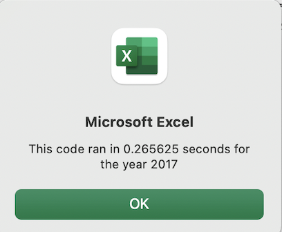

# Reduce, Reuse, Refactor

## Overview of Project
Steve has asked me to prepare an analysis of green energy stocks to help his parents invest their money wisely. In this analysis, I used VBA to analyze 12 green energy stocks over the years 2017 and 2018. The purpose of this project is to refactor the code in this analysis to make sure that it is as efficient as possible so that it is easier for Steve and his parents to analyze more stocks in the future if they so choose.

---
## Results

### 2017 Analysis
The results for the green stocks in 2017 were extremely positive. Most of the stocks in the analysis produced a positive return in 2017: 

 

The two best performing stocks, DQ at 199.4% and SEDG at 184.5%, both almost tripled their return. That is good news for Steve and his parents since DQ, their stock of choice, was the best performing stock of 2017. Additionaly, 11 of the 12 stocks produced positive returns and only 1 stock, TERP, was in the red with a return of -7.2%.

### 2017 Execution
For the original analysis, I used a nested for loop to iterate through each ticker in the ticker array and then to iterate through each row of data:

Excel ran the code in just over 0.265 seconds:

For the refactored code analysis, I used the tickerIndex variable to calculate the volume, starting price and ending price for each ticker and recorded them into the tickerVolumes, tickerStartingPrices and tickerEndingPrices arrays by using a single for loop to iterate over the rows of data:

The refactored code ran in just over 0.066 seconds:

---
### 2018 Analysis
The results for the 2018 analysis were quite the opposite from the 2017 results:

Most of the stocks in the analysis produced negative results in 2018. In fact, only ENPH and RUN produced positive results with returns of 81.9% and 84%. Also, there is bad news for Steve and his parents since their stock, DQ, produced a return of -62.6% and was the worst performing stock in the analysis; an investment in DQ may not be the wisest decision after all. 

In the end, 7 of the 12 stocks increased their total daily volume from 2017 to 2018 but 10 of the 12 were in the red. DQ, JKS, and SPWR were the worst performing stocks with return of -62.6%, -60.5% and -44.6%, respectively.

### 2018 Execution
The original analysis of the 2018 stocks was completed in just over 0.261 seconds:

Meanwhile, the refactored code for the 2018 analysis ran in just over 0.07 seconds:

---
## Summary

### Advantages and Disadvantages

Comparing the original code and the refactored code, there is a clear difference in the run times. The refactored code cuts the run time from the orignial code by about 75%. This difference won't really be noticed when analyzing small amounts of data but will make a huge difference as the data sets become larger. It appears that using the tickerIndex variable and arrays to run the analysis instead of using a nested for loop can save a lot of time and resources when analyzing large amounts of data.

A clear disadvantage of refactoring the code is that it is very easy to clutter perfectly executing code. One misplaced comma or paranthesis and the code will not run correctly. If a lot of lines of code are changed and the code doesn't run, it can take a long time to figure out where the error is and how to fix it, especially if there are a lot of lines of code. 

### Refactoring My VBA Script

In my experience refactoring the VBA code, I did notice the decrease in the execution time of the refactored code. However, I did have trouble at first understanding the logic behind using the tickerIndex variable and the tickerVolumes, tickerStartingPrices and tickerEndingPrices arrays. It took some research until it finally clicked how to write the new code and where exactly to use the tickerIndex variable. Also, I had trouble getting my code to output the correct values to the ticker results table and it took me going through the code several times until I realized that it was because I had inverted the tickerStartingPrices and tickerEndingPrices in the calculation of the return values for each ticker. So while there is a clear advantage to refactoring the code, it is very easy to make mistakes in this process since refactoring is essentially coming up with new logic to my code and it is very easy to write code incorrectly. When refactoring code, it is very important to write a plan for the logic and to proofread the code so that it executes correctly.  